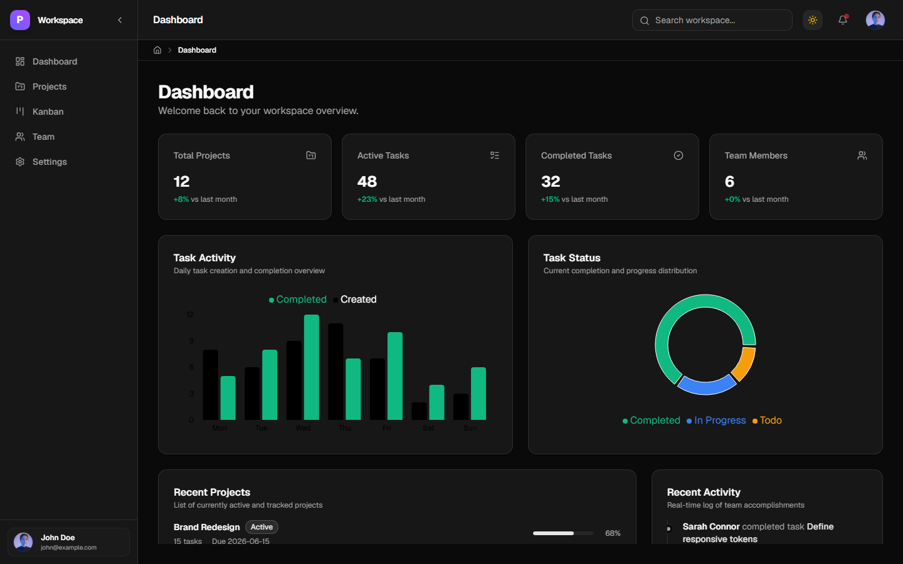

# Project Management Dashboard

A premium, Linear-inspired project management dashboard built entirely by AI agents. Features a collapsible sidebar, real-time dashboard analytics, Kanban-ready board structure, authentication flow, and a polished dark/light design system — all running on modern React with zero hand-written code.




---

## About the Project

This is a senior-level React reference project that demonstrates production-grade patterns, architecture, and component design. It was built to showcase what AI-assisted development can achieve when guided by precise prompts and a well-structured agent team.

Every aspect follows strict coding standards — named exports, interface-first typing with `I` prefix, barrel file re-exports, path aliases, compound components, custom hooks, error boundaries, portals, render props patterns, and a clear separation of concerns between client state (Redux Toolkit) and server state (TanStack Query).

## How It Was Built

This entire project was created using **Google Antigravity IDE** with **Gemini Pro** and **OpenCode AI** — a multi-agent AI system. A team of specialized AI agents (Product Manager, UI/UX Designer, Frontend Engineer, Test Engineer, QA Engineer, DevOps) worked together phase by phase. Each phase began with an implementation plan and walkthrough document. The AI agents followed strict rules for TypeScript, component architecture, state management, and testing — producing a codebase that meets senior engineering standards without a single line written manually.

## Features

| Page / Feature      | Status     |
| ------------------- | ---------- |
| Auth (Login / Signup / Forgot Password) | ✅ Complete |
| Dashboard with charts and stats         | ✅ Complete |
| Collapsible sidebar navigation          | ✅ Complete |
| Dark / Light theme toggle               | ✅ Complete |
| Projects list and detail view           | ✅ Complete |
| Kanban board with drag-and-drop         | 🔄 Planned |
| Team members with virtualized list      | 🔄 Planned |
| Notifications with badge and mark-read  | 🔄 Planned |
| Settings (profile, password, theme)     | 🔄 Planned |
| End-to-end Playwright tests             | 🔄 Planned |

## Tech Stack

All version numbers are taken from `package.json`.

### Core

| Library       | Version |
| ------------- | ------- |
| React         | ^19.2.6 |
| React DOM     | ^19.2.6 |
| TypeScript    | ~6.0.2  |
| Vite          | ^8.0.12 |

### Styling

| Library              | Version   |
| -------------------- | --------- |
| Tailwind CSS         | ^4.3.0    |
| tw-animate-css       | ^1.4.0    |
| class-variance-authority | ^0.7.1 |
| clsx                 | ^2.1.1    |
| tailwind-merge       | ^3.6.0    |
| @fontsource-variable/geist | ^5.2.9 |

### State Management

| Library        | Version   |
| -------------- | --------- |
| @reduxjs/toolkit | ^2.12.0 |
| react-redux    | ^9.3.0    |

### Data Fetching

| Library               | Version    |
| --------------------- | ---------- |
| @tanstack/react-query | ^5.100.11  |
| @tanstack/react-virtual | ^3.13.25 |

### Routing

| Library         | Version |
| --------------- | ------- |
| react-router-dom | ^7.15.1 |

### Forms

| Library            | Version |
| ------------------ | ------- |
| react-hook-form    | ^7.76.0 |
| zod                | ^4.4.3  |
| @hookform/resolvers | ^5.4.0 |

### HTTP

| Library | Version |
| ------- | ------- |
| ky      | ^2.0.2  |

### Animation & Visualization

| Library       | Version   |
| ------------- | --------- |
| framer-motion | ^12.40.0  |
| recharts      | ^3.8.1    |
| lucide-react  | ^1.16.0   |
| @hello-pangea/dnd | ^18.0.1 |

### UI Library

| Library   | Version |
| --------- | ------- |
| shadcn     | ^4.8.0  |
| radix-ui  | ^1.4.3  |

### Testing

| Library                     | Version   |
| --------------------------- | --------- |
| vitest                      | ^4.1.7    |
| @testing-library/react      | ^16.3.2   |
| @testing-library/jest-dom   | ^6.9.1    |
| @playwright/test            | ^1.60.0   |
| jsdom                       | ^29.1.1   |

### Mocking

| Library | Version  |
| ------- | -------- |
| msw     | ^2.14.6  |

### Logging

| Library | Version   |
| ------- | --------- |
| pino    | ^10.3.1   |

---

## Architecture and Folder Structure

```
src/
├── components/        # Reusable UI components (one file per component)
│   ├── ActivityChart/
│   ├── ActivityFeed/
│   ├── Breadcrumb/
│   ├── CompletionChart/
│   ├── ErrorBoundary/
│   ├── ProtectedRoute/
│   ├── RecentProjects/
│   ├── Sidebar/
│   ├── StatsCard/
│   ├── Topbar/
│   └── ui/            # shadcn/ui base components (button, etc.)
├── pages/             # Page-level components (Dashboard, Auth pages)
├── hooks/             # Custom React hooks (useAuth, useTheme, useDashboard)
├── store/             # Redux Toolkit slices and store config
├── types/             # All interfaces (prefixed with I)
├── services/          # API call functions using ky
│   └── mock/          # MSW handlers and browser worker
├── utils/             # Pure utility functions (logger)
├── lib/               # Library wrappers (cn utility)
├── layouts/           # Layout wrappers (AppLayout, AuthLayout)
├── styles/            # Design system documentation
├── test/              # Test setup
├── App.tsx            # Root component with router and providers
└── main.tsx           # Entry point with MSW boot
```

## Coding Standards and Rules

- **Interfaces**: All object shapes use interfaces (never type aliases), prefixed with `I` — e.g. `IUser`, `IProjectProps`, `ITaskCard`
- **Exports**: All components use named exports — never default exports
- **Props Destructuring**: Props are never destructured at the function declaration level; destructuring happens inside the function body
- **Barrel Files**: Every folder with more than one file has an `index.ts` that re-exports everything
- **Path Aliases**: All imports use `@/` — no relative paths like `../../components`
- **State Management**: Redux Toolkit for client state; TanStack Query for server state — never mixed
- **Animations**: Framer Motion for all animations; never inline styles except for motion dynamic values

## Phase Breakdown

| Phase | Name | Status |
| ----- | ---- | ------ |
| 1 | Project Setup & Design System | 🟢 Complete |
| 2 | Authentication | 🟢 Complete |
| 3 | Core Layout & Navigation | 🟢 Complete |
| 4 | Dashboard | 🟢 Complete |
| 5 | Projects | 🟢 Complete |
| 6 | Kanban Board | 🔴 Not Started |
| 7 | Team Members, Notifications & Settings | 🔴 Not Started |
| 8 | End to End Tests & Final Polish | 🔴 Not Started |

Each phase includes implementation plans, walkthrough documentation, and strict verification (TypeScript check → build → test → coverage → QA visual inspection).

---

## Getting Started

### Prerequisites

- Node.js >= 18
- pnpm (preferred) or npm

### Install

```bash
pnpm install
```

### Run Development Server

```bash
pnpm run dev
```

Open [http://localhost:5173](http://localhost:5173) in your browser. MSW mock service worker starts automatically in development mode.

### Run Tests

```bash
pnpm run test          # Run all unit and UI tests
pnpm run test --coverage  # Run with coverage report
```

### Build for Production

```bash
pnpm run build
```

Output is written to the `dist/` directory.

### Lint

```bash
pnpm run lint
```

---

## AI Prompts

All AI prompts used to build this project are documented in [`PROMPTS.md`](./PROMPTS.md). Each phase includes the exact `/startcycle` prompt that kicked it off, plus any fix prompts used during development.

---

> **This entire project was built without writing a single line of code manually.**
Every component, hook, test, style, and configuration file was generated by AI agents 
using Google Antigravity IDE with Gemini Pro and OpenCode AI. The agents.md, phases.md, 
and prompt files are the only human-guided documents in this repository.
